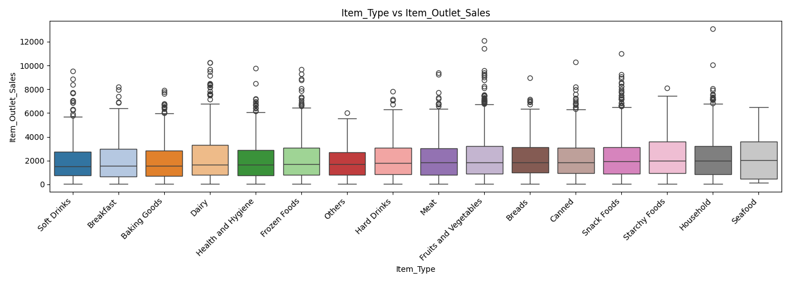

# 🛒 Prediction of Product Sales

> A machine learning project to predict sales of food items sold across various retail stores.

---

## 📌 Project Overview

This project aims to build a predictive model that estimates the sales (`Item_Outlet_Sales`) of food products sold at different store outlets. By analyzing historical data, the model helps retailers understand key factors that drive sales and make better inventory and pricing decisions.

---

## 🎯 Business Problem

Retailers often struggle to forecast product demand accurately, leading to overstocking or stockouts. This project addresses that challenge by using machine learning regression models to predict item-level sales based on product and store attributes.

---

## 📂 Dataset

The dataset contains information about food items and store outlets. Key features include:

| Feature | Description |
|---|---|
| `Item_Identifier` | Unique product ID |
| `Item_Weight` | Weight of the product |
| `Item_Fat_Content` | Low Fat / Regular |
| `Item_Visibility` | % of total display area allocated to the product |
| `Item_Type` | Category of the product (e.g., Dairy, Snack Foods) |
| `Item_MRP` | Maximum Retail Price |
| `Outlet_Identifier` | Unique store ID |
| `Outlet_Establishment_Year` | Year the store was established |
| `Outlet_Size` | Size of the store (Small / Medium / High) |
| `Outlet_Location_Type` | Tier of the city |
| `Outlet_Type` | Grocery Store / Supermarket Type |
| `Item_Outlet_Sales` | **Target variable** — sales of the product |

---

## 🔧 Workflow

1. **Data Loading & Exploration** — Understanding the structure and distribution of the data
2. **Data Cleaning** — Handling missing values in `Item_Weight` and `Outlet_Size`
3. **Exploratory Data Analysis (EDA)** — Visualizing patterns and correlations
4. **Feature Engineering** — Encoding categorical variables, fixing inconsistencies
5. **Model Building** — Training regression models
6. **Model Evaluation** — Comparing models using RMSE and R² score

---

## 🤖 Models Used

- **Linear Regression** — Baseline model
- **Decision Tree Regressor** — Captures non-linear relationships
- **Random Forest Regressor** — Ensemble method for improved accuracy

---

## 📊 Evaluation Metrics

| Metric | Description |
|---|---|
| **R² Score** | Proportion of variance explained by the model |
| **RMSE** | Root Mean Squared Error — lower is better |
| **MAE** | Mean Absolute Error |

---

## 🛠️ Tech Stack

- **Python 3**
- **Pandas** — Data manipulation
- **NumPy** — Numerical computation
- **Matplotlib / Seaborn** — Data visualization
- **Scikit-learn** — Machine learning models and preprocessing
- **Jupyter Notebook** — Development environment

---

## 📁 Project Structure

```
Prediction-of-Product-Sales/
│
├── Prediction of product sales .ipynb   # Initial exploration notebook
├── Sales Prediction.ipynb               # EDA and feature engineering
├── Sales prediction 4.ipynb             # Model building iteration
├── Sales_prediction_5.ipynb             # Final model and evaluation
├── images/
│   ├── heatmap.png
│   ├── histogram.png
│   ├── feat_Item_MRP_multivariate.png
│   ├── feat_Outlet_Type_multivariate.png
│   ├── feat_Item_Type_multivariate.png
│   └── feat_Outlet_Location_Type_multivariate.png
└── README.md
```

---

## 🚀 How to Run

1. Clone the repository:
   ```bash
   git clone https://github.com/Tarteel89/Prediction-of-Product-Sales.git
   cd Prediction-of-Product-Sales
   ```

2. Install dependencies:
   ```bash
   pip install pandas numpy matplotlib seaborn scikit-learn jupyter
   ```

3. Launch Jupyter Notebook:
   ```bash
   jupyter notebook
   ```

4. Open `Sales_prediction_5.ipynb` for the final version of the project.

---

## 📊 Visualizations

### Correlation Heatmap


Shows the correlation between all numerical features and the target variable `Item_Outlet_Sales`. `Item_MRP` shows the strongest positive correlation with sales.

### Item_MRP vs Sales


Scatter plot showing the relationship between the product's maximum retail price and its sales. A clear positive trend confirms that higher-priced items tend to generate more revenue.

### Outlet_Type vs Sales


Box plot comparing sales distribution across different outlet types. Supermarket Type 3 consistently shows the highest median sales, while Grocery Stores have the lowest.

### Item_Type vs Sales


Box plot showing how sales vary across product categories. Certain categories such as Seafood and Starchy Foods show notably higher median sales.

### Outlet_Location_Type vs Sales


Box plot comparing sales across Tier 1, 2, and 3 cities, revealing how store location affects product performance.

### Distribution of Item Outlet Sales


Histogram of the target variable showing a right-skewed distribution, indicating that most items have moderate sales with a few high-performing outliers.

---

## 📈 Key Insights

- **Item MRP** is one of the strongest predictors of sales.
- **Outlet Type** significantly influences item sales — Supermarkets outperform Grocery Stores.
- Items with **higher visibility** don't always lead to higher sales, suggesting other factors play a larger role.
- **Outlet age** (years since establishment) has a mild positive effect on sales performance.

---

## 👤 Author

**Tarteel89**  
[GitHub Profile](https://github.com/Tarteel89)

---

## 📄 License

This project is open-source and available under the [MIT License](LICENSE).# Prediction-of-Product-Sales
this project will be a sales prediction for food items sold at various stores.
