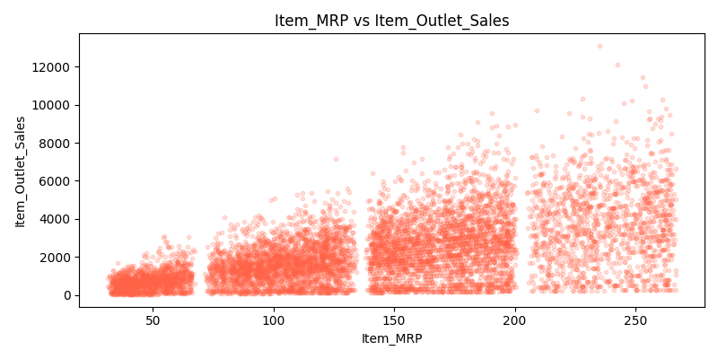
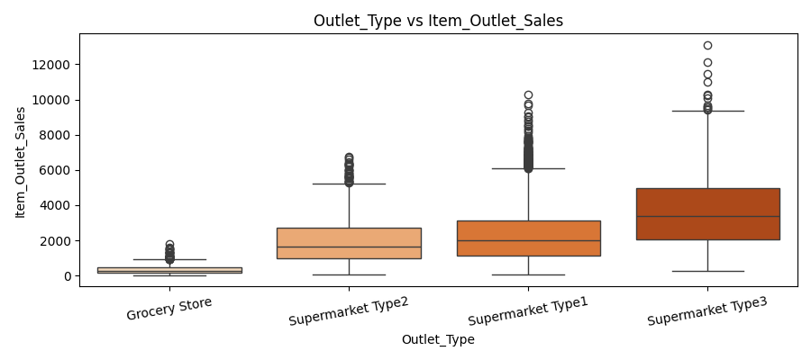
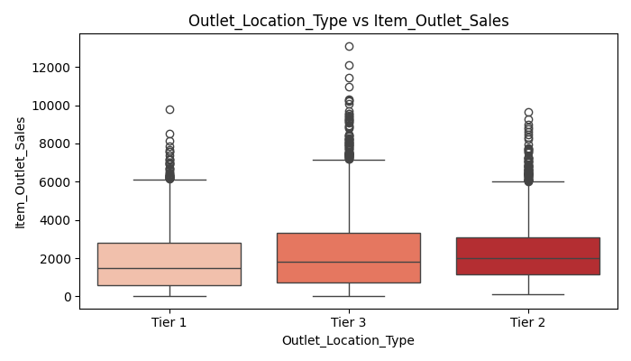
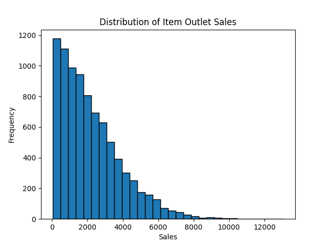
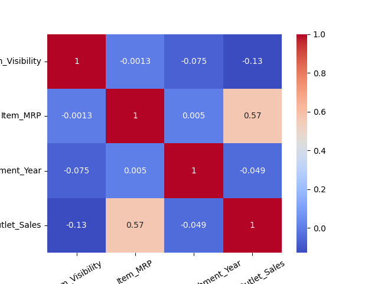

# 🛒 Prediction of Product Sales

> A machine learning project to predict sales of food items sold across various retail stores.

# 📌 Project Overview

>Retailers frequently struggle to forecast demand accurately — leading to costly overstocking or stockouts. This project addresses that challenge by building and comparing regression models that predict Item Outlet Sales based on product characteristics and store attributes.
The final model enables retailers to anticipate sales performance by store type, location, and product category — supporting smarter inventory and pricing decisions.

# 💡 Key Insights

# 1. Item Price (MRP) is the Strongest Predictor of Sales

A clear positive relationship exists between a product's Maximum Retail Price and its total outlet sales. Higher-priced items consistently generate more revenue across all store types and locations
This insight suggests that premium-priced products are reliable revenue drivers and that retailers should ensure adequate stock levels for high-MRP items.

# 2. Supermarkets Dramatically Outperform Grocery Stores

Store type has a major impact on sales volume. Supermarket Type 3 records the highest median sales, while Grocery Stores consistently show the lowest — often by a significant margin.
This finding highlights that store format — not just product type or price — is a critical factor in forecasting. Inventory strategies should differ substantially between store categories.

# 3. Outlet_Location_Type vs Sales
   

Where is the best place to open a new store?"
From the plot, you can see that Tier 3 — smaller cities — have sales that are comparable or sometimes higher than Tier 1 big cities. This is surprising to many people because common sense says big cities = more sales, but the data says otherwise.
This means for business owners:

Expanding in Tier 3 can be an opportunity rather than a risk. Competition in Tier 1 is higher and can eat into profits, while opening costs in Tier 3 are lower + similar sales = better profit margin

# 4. Distribution of Item Outlet Sales
 

 Histogram of the target variable showing a right-skewed distribution, indicating that most items have moderate sales with a few high-performing outliers.

## 5. Correlation Heatmap
  

Shows the correlation between all numerical features and the target variable `Item_Outlet_Sales`. `Item_MRP` shows the strongest positive correlation with sales.

# 📊 Model Summary & Evaluation

Three regression models were trained and evaluated on a held-out test set:
ModelTrain R²Test R²Fit AssessmentLinear Regression~0.56~0.55Slight underfit — too simple for this dataRandom Forest (Default)~0.94~0.59 Overfitting — memorises training dataRandom Forest (Tuned)~0.80~0.61✅ Best balance — recommended model

# ⭐ Recommended Model: Tuned Random Forest
The tuned Random Forest was selected as the final model. It was optimised using GridSearchCV across key hyperparameters (number of trees, max depth, minimum samples to split), reducing the overfitting seen in the default version while maintaining strong predictive performance.
What the metrics mean in practice:

R² ≈ 0.61 — The model correctly explains about 61% of the variation in product sales across stores. For every 10 times you ask "Why does Store A outsell Store B?", the model identifies the right reason approximately 6 times.
RMSE ≈ $1,000 — On average, predictions are off by about $1,000 per product-outlet combination. RMSE was chosen as the secondary metric because large prediction errors carry higher business risk (e.g., underestimating a top seller causes stockouts), and RMSE penalises large errors more heavily than MAE.

# 📂 Dataset
The dataset contains product and store attributes for food items sold across multiple retail outlets. Key features include item weight, fat content, visibility, MRP, product category, store size, location tier, and outlet type. The target variable is Item_Outlet_Sales.

# 🛠️ Tech Stack
Python · Pandas · NumPy · Matplotlib · Seaborn · Scikit-learn

# 👤 Author
Tarteel89 — GitHub Profile

#  📄 License

This project is open-source and available under the [MIT License](LICENSE).
